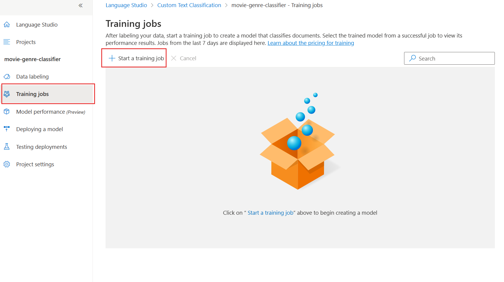
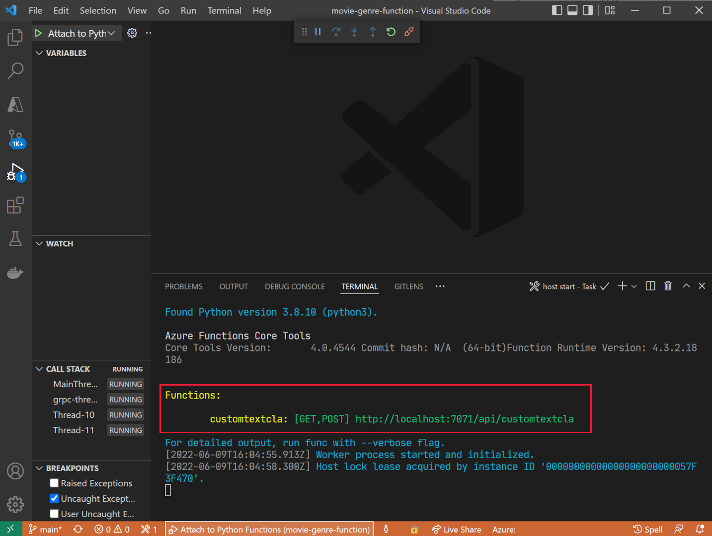
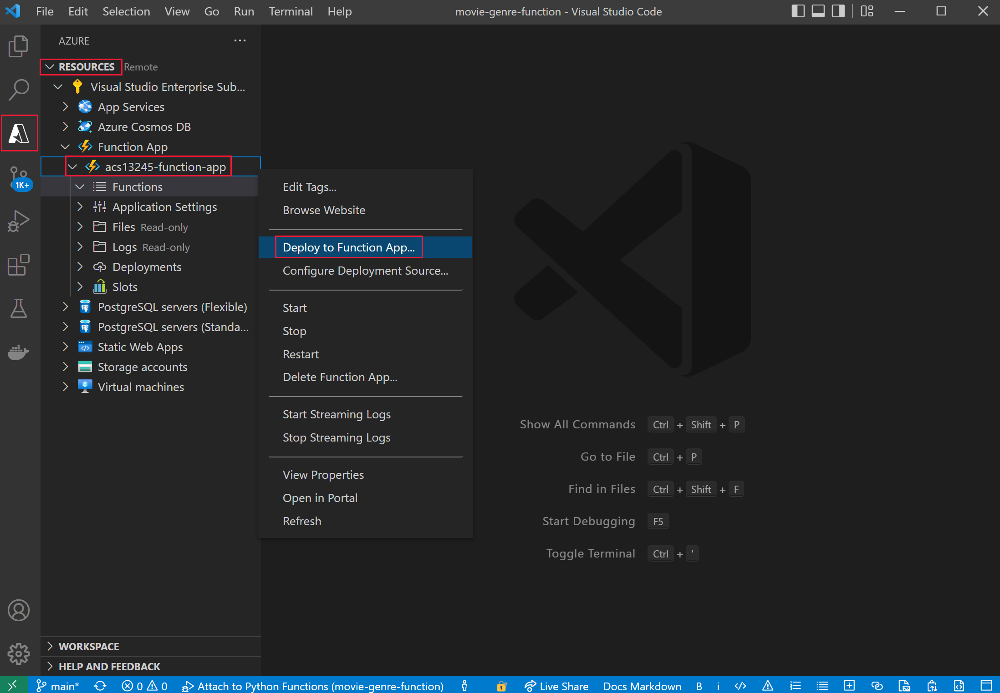
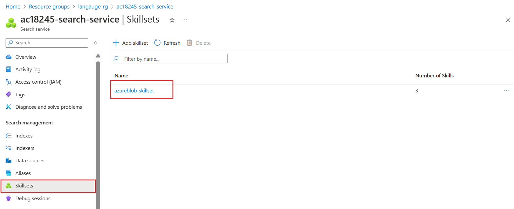
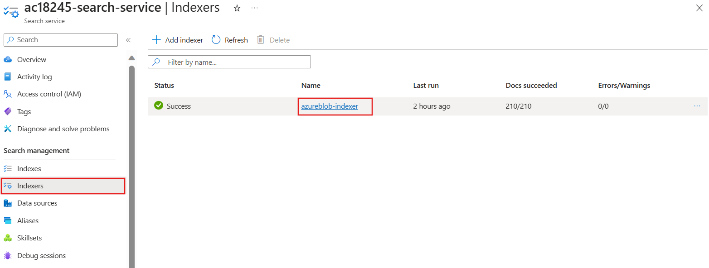

---
lab:
  title: Enrichir un index de recherche IA avec des classes personnalisées
---

# Enrichir un index de recherche IA avec des classes personnalisées

Vous avez créé une solution de recherche et souhaitez maintenant ajouter Azure AI Services pour les enrichissements linguistiques de vos index.

Dans cet exercice, vous allez créer une solution Azure AI Services et enrichir un index avec les résultats d’un projet de classification de texte personnalisée Language Studio. Vous allez créer une application de fonction pour connecter ensemble la recherche et votre modèle de classification.

> **Remarque** Pour effectuer cet exercice, vous aurez besoin d’un abonnement Microsoft Azure. Si vous n’en avez pas, vous pouvez vous inscrire à un essai gratuit sur [https://azure.com/free](https://azure.com/free?azure-portal=true).

## Configurer votre environnement de développement avec Python, VS Code et les extensions VS Code

Installez ces outils pour faire cet exercice. Vous pouvez néanmoins toujours suivre les étapes sans ces outils.

1. Installer [VS Code](https://code.visualstudio.com/)
1. Installer [Azure Functions Core Tools](https://github.com/Azure/azure-functions-core-tools)
1. Installer [Azure Tools Extensions for VS Code](https://code.visualstudio.com/docs/azure/extensions)
1. Installez [Python 3.8](https://www.python.org/downloads/release/python-380/) pour votre système d’exploitation.
1. Installer [Python Extension for VS Code](https://marketplace.visualstudio.com/items?itemName=ms-python.python)

## Configurer vos ressources Azure

Pour gagner du temps, sélectionnez ce modèle Azure ARM pour créer des ressources dont vous aurez besoin plus tard dans l’exercice.

### Déployer un modèle ARM prédéfini

1. [](https://portal.azure.com/#create/Microsoft.Template/uri/https%3A%2F%2Fraw.githubusercontent.com%2FMicrosoftLearning%2Fmslearn-doc-intelligence%2Fmain%2Fcognitive-search%2Fazuredeploy.json) sélectionnez ce lien pour créer vos ressources de démarrage. Vous devrez peut-être copier et coller le [lien direct](https://portal.azure.com/#create/Microsoft.Template/uri/https%3A%2F%2Fraw.githubusercontent.com%2FMicrosoftLearning%2Fmslearn-doc-intelligence%2Fmain%2Fcognitive-search%2Fazuredeploy.json) dans votre barre de recherche.

    
1. Dans **Groupe de ressources**, sélectionnez **Créer**, nommez-le **cog-search-language-exe**.
1. Dans **Région**, sélectionnez une [région prise en charge](/azure/ai-services/language-service/custom-text-classification/service-limits#regional-availability) proche de vous.
1. Le **Préfixe de ressource** doit être globalement unique : entrez un préfixe constitué d’un nombre aléatoire et de caractères minuscules, par exemple **acs18245**.
1. Dans **Emplacement**, sélectionnez la même région que celle que vous avez choisie ci-dessus.
1. Sélectionnez **Revoir + créer**.
1. Sélectionnez **Create** (Créer).

    > **Remarque** Une erreur **Vous devez accepter les conditions d’utilisation ci-dessous pour pouvoir créer cette ressource** s’affiche. En sélectionnant **Créer**, vous les acceptez.

1. Sélectionnez **Accéder au groupe de ressources** pour voir toutes les ressources que vous avez créées.

    
Vous allez configurer un index Recherche cognitive Azure, créer une fonction Azure et créer un projet Language Studio pour identifier les genres de films à partir de leur résumé.

### Charger des exemples de données pour entraîner les services linguistiques

Cet exercice utilise 210 fichiers texte qui contiennent un résumé de l’intrigue pour un film. Le nom des fichiers texte est le titre du film. Le dossier contient également un fichier **movieLabels.json** qui mappe les genres d’un film au fichier. Pour chaque fichier, il y a une entrée JSON comme celle-ci :

```json
{
    "location": "And_Justice_for_All.txt",
    "language": "en-us",
    "classifiers": [
        {
            "classifierName": "Mystery"
        },
        {
            "classifierName": "Drama"
        },
        {
            "classifierName": "Thriller"
        },
        {
            "classifierName": "Comedy"
        }
    ]
},
```

1. Téléchargez les [exemples de données](https://github.com/Azure-Samples/cognitive-services-sample-data-files/blob/master/language-service/Custom%20text%20classification/Custom%20multi%20classification%20-%20movies%20summary.zip) depuis GitHub et enregistrez-les localement sur votre machine.

    
1. Ouvrez le fichier **Custom multi classification - movies summary.zip**, puis extrayez le dossier contenant tous les fichiers.

    > **Remarque**Vous allez utiliser ces fichiers pour entraîner un modèle dans Language Studio, et également indexer tous les fichiers dans Recherche cognitive Azure.

1. Dans le [portail Azure](https://portal.azure.com/), sélectionnez **Groupes de ressources**, puis votre groupe de ressources.
1. Sélectionnez le compte de stockage que vous avez créé, par exemple **acs18245str**.

    
1. Sélectionnez **Conteneurs** à gauche, puis **+ Conteneur**.
1. Dans le volet **Nouveau conteneur**, dans **Nom**, entrez **language-studio-training-data**.
1. Dans **Niveau d’accès public**, choisissez **Conteneur (accès en lecture anonyme pour les conteneurs et les objets blob)**.
1. Sélectionnez **Créer**.
1. Sélectionnez le conteneur que vous venez de créer, **language-studio-training-data**.
    
1. Sélectionnez **Charger** en haut du volet.
1. Dans le volet **Charger l’objet blob**, sélectionnez **Parcourir les fichiers**.
1. Accédez à l’emplacement où vous avez téléchargé les exemples de fichiers, puis sélectionnez tous les fichiers texte (`.txt`) et JSON (`.json`).
1. Sélectionnez **Charger** dans le volet.
1. Fermez le volet **Charger un objet blob**.

### Créer une ressource de langue

1. Dans le lien de la barre de navigation en haut de la page, sélectionnez **Accueil**.
1. Sous **Service de langage**, sélectionnez **Créer**.
1. Sélectionnez **Créer**.
1. Sélectionnez l’option qui inclut **Classification de texte personnalisée et Reconnaissance d’entités nommées personnalisées**.

    
1. Sélectionnez **Continuer pour créer votre ressource**.

    
1. Dans **Groupe de ressources**, choisissez **cog-search-language-exe**.
1. Dans **Région**, sélectionnez la région que vous avez utilisée ci-dessus.
1. Dans **Nom**, entrez **learn-language-service-for-custom-text**. Ce nom doit être globalement unique. Vous devrez peut-être ajouter des caractères ou des nombres aléatoires à la fin.
1. Pour **Niveau tarifaire**, sélectionnez **S**.
1. Dans **Compte de stockage nouveau/existant**, sélectionnez **Compte de stockage existant**.
1. Dans **Comptes de stockage dans l’abonnement et la région de ressource sélectionnés actuels**, sélectionnez le compte de stockage que vous avez créé, par exemple **acs18245str**.
1. Acceptez les conditions d’utilisation **Notice sur l’IA responsable**, puis sélectionnez **Vérifier + créer**.
1. Sélectionnez **Créer**.
1. Attendez que les ressources soient déployées, puis sélectionnez **Accéder au groupe de ressources**.
1. Sélectionnez **learn-language-service-for-custom-text**.

    
1. Faites défiler vers le bas dans le volet **Vue d’ensemble**, puis sélectionnez **Bien démarrer avec Language Studio**.
1. Si vous êtes invité à choisir une ressource de langue, sélectionnez celle que vous avez créée.

### Créer un projet de classification de texte personnalisée dans Language Studio

1. Dans la page d’accueil de Language Studio, sélectionnez **Créer**, puis sélectionnez **Classification de texte personnalisée**.

    

1. Cliquez sur **Suivant**.

    
1. Sélectionnez **Classification multi-étiquette**, puis sélectionnez **Suivant**.

    

1. Dans **Nom**, entrez **movie-genre-classifier**.
1. Dans **Langue principale du texte**, sélectionnez **Anglais (US)**.
1. Dans **Description**, entrez **A model that can identify a movie genre from the summary** (Un modèle qui peut identifier le genre d’un film à partir du résumé).
1. Sélectionnez **Oui, activer le jeu de données multilingue**.
1. Cliquez sur **Suivant**.

    

1. Dans **Conteneur de stockage d’objets blob**, choisissez **language-studio-training-data**.
1. Sélectionnez **Oui, mes documents sont déjà étiquetés et j’ai un fichier d’étiquettes JSON correctement mis en forme**.
1. Dans **Étiqueter des documents**, choisissez **movieLabels**.
1. Cliquez sur **Suivant**.
1. Sélectionnez **Créer un projet**.

### Entraîner votre modèle IA de classification de texte personnalisée

1. Sur la gauche, sélectionnez **Travaux d’entraînement**.

    

1. Sélectionnez **+ Démarrer un travail d’entraînement**.

    
1. Dans **Entraîner un nouveau modèle**, entrez **movie-genre-classifier**.
1. Sélectionnez **Train** (Entraîner).
1. L’entraînement du modèle classifieur doit prendre moins de 10 minutes. Attendez que l’état passe à **Entraînement réussi**.

### Déployer votre modèle IA de classification de texte personnalisée

1. Sur la gauche, sélectionnez **Déploiement d’un modèle**.

    
1. Sélectionnez **Ajouter un déploiement**.

    
1. Dans **Créer un nom de déploiement**, entrez **test-release**.
1. Dans **Modèle**, sélectionnez **movie-genre-classifier**.
1. Sélectionnez **Déployer**.

Laissez cette page web ouverte pour plus tard dans cet exercice.

### Créer un index Recherche Azure AI

Créez un index de recherche que vous pouvez enrichir avec ce modèle : vous allez indexer tous les fichiers texte qui contiennent les résumés de film que vous avez déjà téléchargés.

1. Dans le [portail Azure](https://portal.azure.com/), sélectionnez **Groupes de ressources**, sélectionnez votre groupe de ressources, puis le compte de stockage que vous avez créé, par exemple **acs18245str**.
1. Sélectionnez **Conteneurs** à gauche, puis **+ Conteneur**.
1. Dans le volet **Nouveau conteneur**, dans **Nom**, entrez **search-data**.
1. Dans **Niveau d’accès anonyme**, choisissez **Conteneur**.
1. Sélectionnez **Créer**.
1. Dans le nouveau conteneur que vous venez de créer, entrez **search-data**.
1. Sélectionnez **Charger** en haut du volet.
1. Dans le volet **Charger l’objet blob**, sélectionnez **Parcourir les fichiers**.
1. Accédez à l’emplacement où vous avez téléchargé les exemples de fichiers, puis sélectionnez **SEULEMENT** les fichiers texte (`.txt`).
1. Sélectionnez **Charger** dans le volet.
1. Fermez le volet **Charger un objet blob**.

### Importer des documents dans Recherche Azure AI

1. Sur la gauche, sélectionnez **Groupes de ressources**, sélectionnez votre groupe de ressources, puis votre service de recherche.

1. Sélectionnez **Importer des données**.

    
1. Dans **Source de données**, sélectionnez **Stockage Blob Azure**.
1. Dans **Nom de la source de données**, entrez **movie-summaries**.
1. Sélectionnez **Choisir une connexion existante**, sélectionnez votre compte de stockage, puis le conteneur que vous venez de créer, **search-data**.
1. Sélectionnez **Ajouter des compétences cognitives (facultatif)**.
1. Développez la section **Attacher AI Services**, puis sélectionnez le service Azure AI sous Gratuit.

    
1. Développez la section **Ajouter des enrichissements**.

    
1. Laissez tous les champs avec leurs valeurs par défaut, puis sélectionnez **Extraire des noms de personnes**.
1. Sélectionnez **Extraire les phrases clés**.
1. Sélectionnez **Détecter la langue**.
1. Sélectionnez **Suivant : Personnaliser l’index cible**.

    
1. Laissez tous les champs avec leurs valeurs par défaut ; pour **metadata_storage_name**, sélectionnez **Récupérable** et **Possibilité de recherche**.
1. Sélectionnez **Suivant : Créer un indexeur**.
1. Sélectionnez **Envoyer**.

L’indexeur s’exécute et crée un index des 210 fichiers texte. Vous n’avez pas besoin d’attendre pour passer aux étapes suivantes.

## Créer une application de fonction pour enrichir votre index de recherche

Vous allez maintenant créer une application de fonction Python que votre ensemble de compétences personnalisé de recherche cognitive va appeler. L’application de fonction va utiliser votre modèle de classifieur de texte personnalisé pour enrichir votre index de recherche.

1. Dans le terminal, clonez ce dépôt GitHub sur votre machine.

    ```bash
    git clone https://github.com/MicrosoftLearning/mslearn-doc-intelligence movie-genre-function
    ```

1. Dans Visual Studio Code, ouvrez le dossier **movie-genre-function** que vous venez de cloner.

    
1. Si vous avez installé toutes les extensions nécessaires, vous êtes invité à optimiser le projet. Sélectionnez **Oui**.
    
1. Sélectionnez votre interpréteur Python, dont la version est normalement 3.8.
1. L’espace de travail va être mis à jour ; si vous êtes invité à le connecter au dossier d’espace de travail, sélectionnez **Oui**.
1. Appuyez sur **F5** pour déboguer l’application.

    
    Si l’application est en cours d’exécution, vous devez voir une URL localhost que vous pouvez utiliser pour les tests locaux.

1. Arrêtez le débogage de l’application en appuyant sur **Maj** + **F5**.

### Déployer votre application de fonction locale sur Azure

1. Dans Visual Studio Code, appuyez sur **F1** pour ouvrir la palette de commandes.
1. Dans la palette de commandes, recherchez et sélectionnez `Azure Functions: Create Function App in Azure...`.
1. Entrez un nom globalement unique pour votre application de fonction, par exemple **acs13245str-function-app**.
1. Dans **Sélectionner une pile d’exécution**, sélectionnez **Python 3.8**.
1. Sélectionnez le même emplacement que celui que vous avez utilisé plus haut.

1. Dans le menu de navigation gauche, sélectionnez l’extension **Azure**.
    
1. Développez **Ressources**, **Application de fonction** sous Abonnement, puis cliquez avec le bouton droit sur la fonction, par exemple **acs13245-function-app**.
1. Sélectionnez **Déployer sur Function App**. Attendez que l’application soit déployée.
1. Développez l’application, cliquez avec le bouton droit sur **Paramètres de l’application**, sélectionnez **Télécharger les paramètres distants**.
1. À gauche, sélectionnez **Explorateur**, puis **local.settings.json**.

    
L’application de fonction doit être connectée à votre modèle de classification de texte personnalisée. Suivez ces étapes pour obtenir les paramètres de configuration.

1. Dans votre navigateur, accédez à **Language Studio** : vous êtes normalement sur la page **Déploiement d’un modèle**.

    
1. Sélectionnez votre modèle. Sélectionnez ensuite **Obtenir l’URL de prédiction**.
1. Sélectionnez l’icône de copie en regard de l’**URL de prédiction**.
1. Dans Visual Studio Code, en bas de **local.settings.json**, collez l’URL de prédiction.
1. Dans **Language Studio**, sur la gauche, sélectionnez **Paramètres du projet**.

    
1. Sélectionnez l’icône de copie en regard de la **Clé principale**.
1. Dans Visual Studio Code, en bas de **local.settings.json**, collez la clé principale.
1. Modifiez les paramètres pour ajouter ces quatre lignes dans le bas, puis copiez le point de terminaison dans la valeur `TA_ENDPOINT`.

    ```json
    ,
    "TA_ENDPOINT": " [your endpoint] ",
    "TA_KEY": " [your key] ",
    "DEPLOYMENT": "test-release",
    "PROJECT_NAME": "movie-genre-classifier"
    ```

1. Copiez la clé principale dans la valeur `TA_KEY`.

    ```json
    {
      "IsEncrypted": false,
      "Values": {
        "AzureWebJobsStorage": "DefaultEndpointsProtocol=https;AccountName=...",
        "FUNCTIONS_EXTENSION_VERSION": "~4",
        "FUNCTIONS_WORKER_RUNTIME": "python",
        "WEBSITE_CONTENTAZUREFILECONNECTIONSTRING": "DefaultEndpointsProtocol=https;AccountName=...",
        "WEBSITE_CONTENTSHARE": "acs...",
        "APPINSIGHTS_INSTRUMENTATIONKEY": "6846...",
        "TA_ENDPOINT": "https://learn-languages-service-for-custom-text.cognitiveservices.azure.com/language/analyze-text/jobs?api-version=2022-05-01",
        "TA_KEY": "7105e938ce1...",
        "DEPLOYMENT": "test-release",
        "PROJECT_NAME": "movie-genre-classifier"
      }
    }

    ```

    Les paramètres doivent se présenter comme ci-dessus, avec les valeurs de votre projet.
 
1. Appuyez sur **Ctrl**+**S** pour enregistrer vos modifications de **local.settings.json**.
1. Dans le menu de navigation gauche, sélectionnez l’extension **Azure**.
1. Développez **Ressources** et, sous votre abonnement, développez **Application de fonction**, puis cliquez avec le bouton droit sur **Paramètres de l’application** et sélectionnez **Charger les paramètres locaux**.

### Tester votre application de fonction distante

Il existe un exemple de requête que vous pouvez utiliser pour tester que votre application de fonction et votre modèle classifieur fonctionnent correctement.

1. Sur la gauche, sélectionnez **Explorateur**, développez le dossier **customtectcla**, puis sélectionnez **sample.dat**.

    
1. Copiez le contenu du fichier.
1. Sur la gauche, sélectionnez l’extension **Azure**.

    
1. Sous l’**Application de fonction**, développez **Fonctions**, cliquez avec le bouton droit sur **customtextcla**, puis sélectionnez **Exécuter la fonction maintenant**.
1. Dans **Entrer le corps de la demande**, collez les exemples de données que vous avez copiés, puis appuyez sur **Entrée**.

    L’application de fonction va répondre avec les résultats JSON.

1. Développez la notification pour voir les résultats en entier.

    
    La réponse JSON devrait se présenter ainsi :

    ```json
    {"values": 
        [
            {"recordId": "0", 
            "data": {"text": 
            [
                {"category": "Action", "confidenceScore": 0.99}, 
                {"category": "Comedy", "confidenceScore": 0.96}
            ]}}
        ]
    }
    ```

### Ajouter un champ à votre index de recherche

Vous avez besoin d’un emplacement pour stocker l’enrichissement retourné par votre nouvelle application de fonction. Suivez ces étapes pour ajouter un nouveau champ composé pour stocker la classification de texte et le score de confiance.

1. Dans le [portail Azure](https://portal.azure.com/), accédez au groupe de ressources qui contient votre service de recherche, puis sélectionnez le service de recherche cognitive que vous avez créé, par exemple **acs18245-search-service**.
1. Dans le volet **Vue d’ensemble**, sélectionnez **Index**.
1. Sélectionnez **azurebob-index**.
1. Sélectionnez **Modifier le fichier JSON**.
1. Ajoutez les nouveaux champs à l’index et collez le JSON sous le champ de contenu.

    ```json
    {
      "name": "textclass",
      "type": "Collection(Edm.ComplexType)",
      "analyzer": null,
      "synonymMaps": [],
      "fields": [
        {
          "name": "category",
          "type": "Edm.String",
          "facetable": true,
          "filterable": true,
          "key": false,
          "retrievable": true,
          "searchable": true,
          "sortable": false,
          "analyzer": "standard.lucene",
          "indexAnalyzer": null,
          "searchAnalyzer": null,
          "synonymMaps": [],
          "fields": []
        },
        {
          "name": "confidenceScore",
          "type": "Edm.Double",
          "facetable": true,
          "filterable": true,
          "retrievable": true,
          "sortable": false,
          "analyzer": null,
          "indexAnalyzer": null,
          "searchAnalyzer": null,
          "synonymMaps": [],
          "fields": []
        }
      ]
    },
    ```

    Votre code doit maintenant se présenter comme ceci.

    
1. Sélectionnez **Enregistrer**.

### Modifier l’ensemble de compétences personnalisées pour appeler votre application de fonction

L’index de recherche cognitive a besoin d’un moyen pour que ces nouveaux champs soient renseignés. Modifiez l’ensemble de compétences que vous avez créé précédemment pour appeler votre application de fonction.

1. En haut de la page, sélectionnez le lien du service de recherche, par exemple **acs18245-search-service | Indexes**.

1. Dans le volet **Vue d’ensemble**, sélectionnez **Ensemble de compétences**.

    
1. Sélectionnez **azureblob-skillset**.
1. Ajoutez la définition de l’ensemble de compétences personnalisées ci-dessous en la collant comme premier ensemble de compétences.

    ```json
    {
      "@odata.type": "#Microsoft.Skills.Custom.WebApiSkill",
      "name": "Genre Classification",
      "description": "Identify the genre of your movie from its summary",
      "context": "/document",
      "uri": "URI",
      "httpMethod": "POST",
      "timeout": "PT30S",
      "batchSize": 1,
      "degreeOfParallelism": 1,
      "inputs": [
        {
          "name": "lang",
          "source": "/document/language"
        },
        {
          "name": "text",
          "source": "/document/content"
        }
      ],
      "outputs": [
        {
          "name": "text",
          "targetName": "class"
        }
      ],
      "httpHeaders": {}
    },
    ```

Vous devez modifier `"uri": "URI"` pour le faire pointer vers votre application de fonction.

1. Dans Visual Studio Code, sélectionnez l’extension **Azure**.

    
1. Sous **Fonctions**, cliquez avec le bouton droit sur **customtextcla**, puis sélectionnez **Copier l’URL de la fonction**.
1. Dans le portail Azure, remplacez l’URI par l’URL de la fonction copiée. 
1. Sélectionnez **Enregistrer**.

### Modifier les mappages de champ dans l’indexeur

Vous avez maintenant des champs pour stocker l’enrichissement et un ensemble de compétences pour appeler votre application de fonction : la dernière étape consiste à indiquer à la recherche cognitive où placer l’enrichissement.

1. En haut de la page, sélectionnez le service de recherche, par exemple le lien **acs18245-search-service | Skillsets**.

    
1. Dans le volet **Vue d’ensemble**, sélectionnez **Indexeurs**.
1. Sélectionnez **azureblob-indexer**.
1. Sélectionnez **Définition d’indexeur (JSON)**.
1. Ajoutez un nouveau mappage de champ de sortie en collant cette définition de champ en haut de la section des champs de sortie.

    ```json
    {
      "sourceFieldName": "/document/class",
      "targetFieldName": "textclass"
    },
    ```

    La définition JSON de l’indexeur doit maintenant se présenter comme ceci :

    
1. Sélectionnez **Enregistrer**.
1. Sélectionnez **Réinitialiser**, puis **Oui**.
1. Sélectionnez **Exécuter**, puis **Oui**.

    Votre service Recherche cognitive Azure exécute votre indexeur mis à jour. L’indexeur utilise l’ensemble de compétences personnalisées modifié. L’ensemble de compétences appelle votre application de fonction avec le document à indexer. Le modèle de classifieur de texte personnalisé utilise le texte du document pour essayer d’identifier le genre du film. Le modèle retourne un document JSON avec des genres et des niveaux de confiance. L’indexeur mappe les résultats JSON aux champs de votre index en utilisant le nouveau mappage des champs de sortie.

1. Sélectionnez **Historique d’exécution**.
1. Vérifiez que l’indexeur s’est bien exécuté sur les 210 documents.

    
    Vous devrez peut-être sélectionner **Actualiser** pour mettre à jour l’état de l’indexeur.

## Tester votre index de recherche enrichi

1. En haut de la page, sélectionnez le service de recherche, par exemple **acs18245-search-service | Indexers**.

1. Dans le volet **Vue d’ensemble**, sélectionnez **Index**.
1. Sélectionnez **azurebob-index**.

    
1. Sélectionnez **Recherche**.
1. Explorer les résultats de la recherche.

Chaque document de l’index doit avoir un nouveau champ `textclass` où il est possible d’effectuer une recherche. Il contient un champ de catégorie avec les genres de film. Il peut y en avoir plusieurs. Il montre également quel est le niveau de confiance du modèle de classification de texte quant au genre identifié.

Maintenant que vous avez terminé l’exercice, supprimez toutes les ressources dont vous n’avez plus besoin.

### Supprimer les ressources de l’exercice

1. Dans le portail Azure, accédez à la page d’accueil et sélectionnez **Groupes de ressources**.
1. Sélectionnez les groupes de ressources dont vous n’avez pas besoin, puis sélectionnez **Supprimer le groupe de ressources**.
