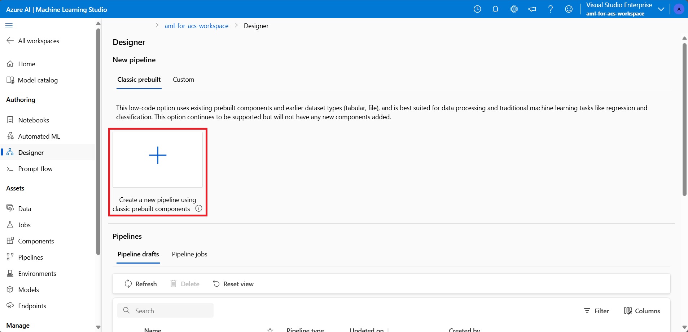
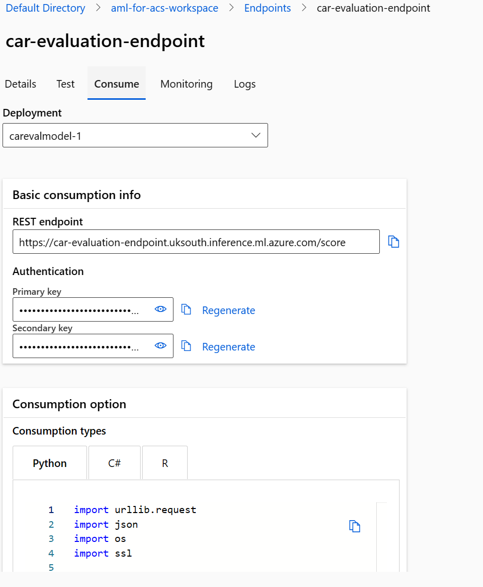

---
lab:
  title: Enrichir un index de recherche en utilisant un modèle Azure Machine Learning
---

# Enrichir un index de recherche en utilisant un modèle Azure Machine Learning

Vous pouvez profiter de la puissance du machine learning pour enrichir un index de recherche. Pour cela, vous allez utiliser un modèle d’apprentissage dans Azure AI Machine Learning studio et l’appeler à partir d’un ensemble de compétences personnalisé d’apprentissage automatique.

Dans cet exercice, vous allez créer un modèle Azure AI Machine Learning Studio, puis l’utiliser pour effectuer l’apprentissage, déployer et tester un point de terminaison à l’aide du modèle. Ensuite, vous allez créer un service Recherche cognitive Azure, créer des exemples de données et enrichir un index en utilisant le point de terminaison Azure AI Machine Learning studio.

> **Remarque** Pour effectuer cet exercice, vous aurez besoin d’un abonnement Microsoft Azure. Si vous n’en avez pas, vous pouvez vous inscrire à une évaluation gratuite dans la page [https://azure.com/free](https://azure.com/free?azure-portal=true).
>

## Création d’un espace de travail Microsoft Azure Machine Learning

Avant d’enrichir votre index de recherche, créez un espace de travail Azure Machine Learning. L’espace de travail vous donne accès au studio Azure AI Machine Learning, un outil graphique que vous pouvez utiliser pour créer des modèles IA et les déployer avant utilisation.

1. Connectez-vous au [portail Azure](https://portal.azure.com).
1. Sélectionnez **+ Créer une ressource**.
1. Faites une recherche sur machine learning, puis sélectionnez **Azure Machine Learning**.
1. Sélectionnez **Créer**.
1. Sélectionnez **Créer** sous **Groupe de ressources** et nommez-le **aml-far-acs-enrichment**.
1. Dans la section des détails d’Espace de travail, pour **Nom**, entrez **aml-for-acs-workspace**.
1. Sélectionnez une **Région** prise en charge près de vous.
1. Utilisez les valeurs par défaut pour le **Compte de stockage**, le **Coffre de clés**, **Application Insights** et le **Registre de conteneurs**.
1. Sélectionnez **Revoir + créer**.
1. Sélectionnez **Create** (Créer).
1. Attendez que l’espace de travail Azure Machine Learning soit déployé, puis sélectionnez **Accéder à la ressource**.
1. Dans le volet Vue d’ensemble, sélectionnez **Lancer Studio**.

## Créer un pipeline d’entraînement de régression

Vous allez maintenant créer un modèle de régression et l’entraîner avec un pipeline Azure AI Machine Learning Studio. Vous effectuerez l’apprentissage de votre modèle sur des données de prix de voiture. Une fois entraîné, le modèle prédira le prix d’une voiture sur la base de ses attributs.

1. Dans la page d’accueil, sélectionnez **Concepteur**.

1. Dans la liste des composants prédéfinis, sélectionnez **Régression - Prédiction du prix des voitures (De base).**

    

1. Sélectionnez **Valider**.

1. Dans le volet **Validation de graphique**, sélectionnez l’erreur **Sélectionner une cible de calcul dans l’Assistant Envoi**.

    
1. Dans la liste déroulante **Sélectionner le type de calcul**, choisissez **Instance de calcul**. Sélectionnez ensuite **Créer un instance de calcul Azure ML**.
1. Dans le champ **Nom du calcul**, entrez un nom unique (tel que **compute-for-training**).
1. Sélectionnez **Vérifier + créer**, puis sélectionnez **Créer**.

1. Dans le champ **Sélectionner une instance de calcul Azure ML**, sélectionnez votre instance à partir de la liste déroulante. Il est possible que vous deviez attendre la fin de l’approvisionnement.

1. Sélectionnez **Valider** à nouveau. Le pipeline doit maintenant avoir une apparence correcte.

    
1. Sélectionnez **De base** dans le volet **Configurer la tâche de pipeline**.
1. Sélectionnez **Créer** sous le nom Expérience.
1. Dans **Nom de la nouvelle expérience**, entrez **linear-regression-training**.
1. Sélectionnez **Vérifier + envoyer**, puis **Envoyer**.

### Créer un cluster d’inférence pour le point de terminaison

Pendant que votre pipeline entraîne un modèle de régression linéaire, vous pouvez créer les ressources dont vous avez besoin pour le point de terminaison. Ce point de terminaison a besoin d’un cluster Kubernetes pour traiter les requêtes web sur votre modèle.

1. Sur la gauche, sélectionnez **Calcul**.

    
1. Sélectionnez **Clusters Kubernetes**, puis **+ Nouveau**.
1. Dans la liste déroulante, sélectionnez **AskCompute**.
1. Dans le volet **Créer AskCompute**, sélectionnez **Créer**.
1. Pour **Emplacement**, sélectionnez la même région que celle choisie pour créer vos autres ressources.
1. Dans la liste des tailles de machine virtuelle, sélectionnez **Standard_A2_v2**.
1. Cliquez sur **Suivant**.
1. Dans **Nom du calcul**, entrez **aml-acs-endpoint**.
1. Sélectionnez **Activer la configuration SSL**.
1. Dans **Domaine feuille**, entrez **aml-for-acs**.
1. Sélectionnez **Créer**.

### Inscrire votre modèle entraîné

Votre travail de pipeline doit maintenant être terminé. Vous allez télécharger les fichiers `score.py` et `conda_env.yaml`. Ensuite, vous inscrirez votre modèle entraîné.

1. Sur la gauche, sélectionnez **Travaux**.

    
1. Sélectionnez votre expérience, puis votre travail terminé dans la table, par exemple, **Régression – Prédiction du prix des véhicules (simple)**. Si vous êtes invité à enregistrer des modifications, sélectionnez **Ignorer** pour celles-ci.
1. Dans le concepteur, sélectionnez **Aperçu du travail** dans le haut à droite, puis le nœud **Entraîner le modèle**.

    
1. Sous l’onglet **Sorties + journaux**, développez le dossier **trained_model_outputs**.
1. À côté de `score.py`, sélectionnez le menu plus (**...**), puis **Télécharger**.
1. À côté de `conda_env.yaml`, sélectionnez le menu plus (**...**), puis **Télécharger**.
1. Sélectionnez **+ Inscrire le modèle** en haut de l’onglet.
1. Dans le champ **Sortie du travail**, sélectionnez le dossier **trained_model_outputs**. Puis sélectionnez **Suivant** en bas du volet.
1. Pour le **Nom** de modèle, entrez **carevalmodel**.
1. Dans **Description**, entrez **Modèle de régression linéaire pour prédire le prix des voitures**.
1. Cliquez sur **Suivant**.
1. Sélectionnez **Inscrire**.

### Modifier le script de scoring pour répondre correctement à Recherche Azure AI

Azure Machine Learning Studio a téléchargé deux fichiers dans l’emplacement de téléchargement par défaut de votre navigateur web. Vous devez modifier le fichier score.py pour changer la façon dont la requête et la réponse JSON sont traitées. Vous pouvez utiliser un éditeur de texte ou un éditeur de code tel que Visual Studio Code.

1. Dans votre éditeur, ouvrez le fichier score.py.
1. Remplacez tout le contenu de la fonction run :

    ```python
    def run(data):
    data = json.loads(data)
    input_entry = defaultdict(list)
    for row in data:
        for key, val in row.items():
            input_entry[key].append(decode_nan(val))

    data_frame_directory = create_dfd_from_dict(input_entry, schema_data)
    score_module = ScoreModelModule()
    result, = score_module.run(
        learner=model,
        test_data=DataTable.from_dfd(data_frame_directory),
        append_or_result_only=True)
    return json.dumps({"result": result.data_frame.values.tolist()})
    ```

    Par ce code Python :

    ```python
    def run(data):
        data = json.loads(data)
        input_entry = defaultdict(list)
        
        for key, val in data.items():
                input_entry[key].append(decode_nan(val))
    
        data_frame_directory = create_dfd_from_dict(input_entry, schema_data)
        score_module = ScoreModelModule()
        result, = score_module.run(
            learner=model,
            test_data=DataTable.from_dfd(data_frame_directory),
            append_or_result_only=True)
        output = result.data_frame.values.tolist()
        
        return {
                "predicted_price": output[0][-1]
        }    
    ```

    Les modifications ci-dessus doivent permettre au mode de recevoir un seul objet JSON avec des attributs de voiture au lieu d’un tableau de voitures.

    L’autre modification vise à retourner uniquement le prix prédit de la voiture, et pas la réponse JSON entière.
1. Enregistrez les modifications dans votre éditeur de texte.

## Créer un environnement personnalisé

Ensuite, vous créez un environnement personnalisé pour pouvoir déployer un point de terminaison en temps réel.

1. Sélectionnez **Environnements** dans le volet de navigation.
1. Sélectionnez l'onglet **Environnements personnalisés**.
1. Sélectionnez **+ Créer**.
1. Pour le **Nom**, entrez **my-custom-environment**.
1. Dans la liste des environnements organisés sous **Sélectionner un type d’environnement**, sélectionnez **automl-gpu:2**.
1. Cliquez sur **Suivant**.
1. Sur votre ordinateur local, ouvrez le fichier `conda_env.yaml` téléchargé plus tôt et copiez son contenu.
1. Retournez au navigateur, puis sélectionnez **conda_dependencies.yaml** dans le volet Personnaliser.
1. Dans le volet de droite, remplacez son contenu par le code copié plus tôt.
1. Sélectionnez **Suivant**, puis **Suivant** à nouveau.
1. Sélectionnez **Créer** pour créer votre environnement personnalisé.

## Déployer le modèle avec le code de scoring mis à jour <!--Option for web service deployment is greyed out. Can't go further after trying several different things.-->

En principe, votre cluster d’inférence est maintenant prêt à être utilisé. Vous avez également modifié le code de scoring pour traiter les requêtes reçues de votre ensemble de compétences personnalisées Recherche cognitive Azure. Vous allez maintenant créer et tester un point de terminaison pour le modèle.

1. Sur la gauche, sélectionnez **Modèles**.
1. Sélectionnez le modèle que vous avez inscrit, **carevalmodel**.

1. Sélectionnez **Déployer**, puis **Point de terminaison en temps réel**.

    
1. Pour le **Nom**, entrez **car-evaluation-endpoint**.
1. Pour le **Type de calcul**, sélectionnez **Managé**.
1. Pour le **Type d’authentification**, sélectionnez **Authentification basée sur une clé**.
1. Sélectionnez **Suivant**, puis **Suivant**.
1. Cliquez à nouveau sur **Suivant**.
1. Dans le champ **Sélectionner un scrip de scoring pour l’inférence**, naviguez vers votre fichier `score.py` mis à jour, puis sélectionnez-le.
1. Dans la liste déroulante **Sélectionner un type d’environnement**, sélectionnez **Environnements personnalisés**.
1. Sélectionnez la case à cocher sur votre environnement personnalisé à partir de la liste.
1. Cliquez sur **Suivant**.
1. Pour la machine virtuelle, sélectionnez **Standard_D2as_v4**.
1. Définir le **Nombre d’instances** sur **1**.
1. Sélectionnez **Suivant**, puis **Suivant** à nouveau.
1. Sélectionnez **Créer**.

Attendez que le modèle soit déployé. Cela peut prendre jusqu’à 10 minutes. Vous pouvez vérifier l’état dans **Notifications** ou la section des points de terminaison dans Azure Machine Learning Studio.

### Tester le point de terminaison de votre modèle entraîné

1. Sur la gauche, sélectionnez **Points de terminaison**.
1. Sélectionnez **car-evaluation-endpoint**.
1. Sélectionnez **Tester**, puis dans **Entrer des données pour tester le point de terminaison**, collez cet exemple JSON.

    ```json
    {
        "symboling": 2,
        "make": "mitsubishi",
        "fuel-type": "gas",
        "aspiration": "std",
        "num-of-doors": "two",
        "body-style": "hatchback",
        "drive-wheels": "fwd",
        "engine-location": "front",
        "wheel-base": 93.7,
        "length": 157.3,
        "width": 64.4,
        "height": 50.8,
        "curb-weight": 1944,
        "engine-type": "ohc",
        "num-of-cylinders": "four",
        "engine-size": 92,
        "fuel-system": "2bbl",
        "bore": 2.97,
        "stroke": 3.23,
        "compression-ratio": 9.4,
        "horsepower": 68.0,
        "peak-rpm": 5500.0,
        "city-mpg": 31,
        "highway-mpg": 38,
        "price": 0.0
    }
    ```

1. Sélectionnez **Tester**, vous devez voir une réponse :

    ```json
    {
        "predicted_price": 5790.948226933133
    }
    ```

1. Sélectionnez **Consommer**.

    
1. Copiez le **point de terminaison REST**.
1. Copiez la **clé primaire**.

### Intégrer un modèle Azure Machine Learning à Recherche Azure AI

Vous créez ensuite un service Recherche cognitive et enrichissez un index avec un ensemble de compétences personnalisées.

### Créer un fichier de test

1. Dans le [portail Azure](https://portal.azure.com/learn.docs.microsoft.com?azure-portal=true), sélectionnez Groupes de ressources.
1. Sélectionnez **aml-for-acs-enrichment**.

    
1. Sélectionnez le compte de stockage, par exemple **amlforacsworks1440637584**.
1. Sélectionnez **Configuration** sous **Paramètres**. Puis définissez **Autoriser l’accès anonyme aux blobs** sur **Activé**.
1. Sélectionnez **Enregistrer**.
1. Sous **Stockage des données**, sélectionnez **Conteneurs**. 
1. Pour créer un conteneur pour y stocker les données d’index. sélectionnez **+ Conteneur**.
1. Dans le volet **Nouveau conteneur**, dans **Nom**, entrez **docs-to-search**.
1. Dans **Niveau d’accès anonyme**, sélectionnez **Conteneur (accès en lecture anonyme pour les conteneurs et les objets blob)**.
1. Sélectionnez **Créer**.
1. Sélectionnez le conteneur **docs-to-search** que vous venez de créer.
1. Dans un éditeur de texte, créez un document JSON :

    ```json
    {
      "symboling": 0,
      "make": "toyota",
      "fueltype": "gas",
      "aspiration": "std",
      "numdoors": "four",
      "bodystyle": "wagon",
      "drivewheels": "fwd",
      "enginelocation": "front",
      "wheelbase": 95.7,
      "length": 169.7,
      "width": 63.6,
      "height": 59.1,
      "curbweight": 2280,
      "enginetype": "ohc",
      "numcylinders": "four",
      "enginesize": 92,
      "fuelsystem": "2bbl",
      "bore": 3.05,
      "stroke": 3.03,
      "compressionratio": 9.0,
      "horsepower": 62.0,
      "peakrpm": 4800.0,
      "citympg": 31,
      "highwaympg": 37,
      "price": 0
    }
    ```

    Enregistrez le document sur votre ordinateur, avec l’extension `test-car.json`.
1. Dans le portail, sélectionnez **Charger**.
1. Dans le volet **Charger l’objet blob**, sélectionnez **Parcourir les fichiers**, accédez à l’emplacement où vous avez enregistré le document JSON, puis sélectionnez-le.
1. Sélectionnez **Télécharger**.

### Créer une ressource Recherche Azure AI

1. Dans la page d’accueil du Portail Azure, sélectionnez **+ Créer une ressource**.
1. Recherchez **rechercher**, puis sélectionnez **Recherche Azure AI**.
1. Sélectionnez **Créer**.
1. Dans **Groupe de ressources**, sélectionnez **aml-for-acs-enrichment**.
1. Dans Nom du service, entrez **acs-enriched**.
1. Pour l’**Emplacement**, sélectionnez la même région que celle utilisée plus tôt.
1. Sélectionnez **Vérifier + créer**, puis sélectionnez **Créer**.
1. Attendez que la ressource soit déployée, puis sélectionnez **Accéder à la ressource**.
1. Sélectionnez **Importer des données**.
1. Dans le volet **Se connecter aux données**, dans la liste **Nom de la source de données**, sélectionnez **Stockage Blob Azure**.
1. Dans le **Nom de la source de données**, sélectionnez **import-docs**.
1. Dans **Mode d’analyse**, sélectionnez **JSON**.
1. Dans **Chaîne de connexion**, sélectionnez **Choisir une connexion existante**.
1. Sélectionnez le compte de stockage dans lequel vous avez chargé, par exemple, **amlforacsworks1440637584**.
1. Dans le volet **Conteneurs**, sélectionnez **docs-to-search**. 
1. Cliquez sur **Sélectionner**.
1. Sélectionnez **Suivant : Ajouter des compétences cognitives (facultatif)**.

### Ajouter des compétences cognitives

1. Développez **Ajouter des enrichissements**, puis sélectionnez **Extraire les noms de personne**.
1. Sélectionnez **Suivant : Personnaliser l’index cible**.
1. Sélectionnez **+ Ajouter un champ** et, dans **Nom du champ**, entrez **predicted_price** en bas de la liste.
1. Dans **Type**, sélectionnez **Edm.Double** pour votre nouvelle entrée.
1. Sélectionnez **Récupérable** pour tous les champs.
1. Sélectionner **Peut faire l’objet d’une recherche** pour **make**.
1. Sélectionnez **Suivant : Créer un indexeur**.
1. Sélectionnez **Envoyer**.

## Ajouter la compétence AML à l'ensemble de compétences

Vous allez maintenant remplacer l’enrichissement des noms de personne par l’ensemble de compétences personnalisées Azure Machine Learning.

1. Dans le volet Vue d’ensemble, sélectionnez **Ensemble de compétences** sous **Gestion de recherche**.
1. Sous **Nom**, sélectionnez **azureblob-skillset**.
1. Remplacez la définition des compétences pour `EntityRecognitionSkill` par ce JSON, sans oublier de remplacer les valeurs de point de terminaison et de clé primaire que vous aviez copiées :

    ```json
    "@odata.type": "#Microsoft.Skills.Custom.AmlSkill",
    "name": "AMLenricher",
    "description": "AML studio enrichment example",
    "context": "/document",
    "uri": "PASTE YOUR AML ENDPOINT HERE",
    "key": "PASTE YOUR PRIMARY KEY HERE",
    "resourceId": null,
    "region": null,
    "timeout": "PT30S",
    "degreeOfParallelism": 1,
    "inputs": [
      {
        "name": "symboling",
        "source": "/document/symboling"
      },
      {
        "name": "make",
        "source": "/document/make"
      },
      {
        "name": "fuel-type",
        "source": "/document/fueltype"
      },
      {
        "name": "aspiration",
        "source": "/document/aspiration"
      },
      {
        "name": "num-of-doors",
        "source": "/document/numdoors"
      },
      {
        "name": "body-style",
        "source": "/document/bodystyle"
      },
      {
        "name": "drive-wheels",
        "source": "/document/drivewheels"
      },
      {
        "name": "engine-location",
        "source": "/document/enginelocation"
      },
      {
        "name": "wheel-base",
        "source": "/document/wheelbase"
      },
      {
        "name": "length",
        "source": "/document/length"
      },
      {
        "name": "width",
        "source": "/document/width"
      },
      {
        "name": "height",
        "source": "/document/height"
      },
      {
        "name": "curb-weight",
        "source": "/document/curbweight"
      },
      {
        "name": "engine-type",
        "source": "/document/enginetype"
      },
      {
        "name": "num-of-cylinders",
        "source": "/document/numcylinders"
      },
      {
        "name": "engine-size",
        "source": "/document/enginesize"
      },
      {
        "name": "fuel-system",
        "source": "/document/fuelsystem"
      },
      {
        "name": "bore",
        "source": "/document/bore"
      },
      {
        "name": "stroke",
        "source": "/document/stroke"
      },
      {
        "name": "compression-ratio",
        "source": "/document/compressionratio"
      },
      {
        "name": "horsepower",
        "source": "/document/horsepower"
      },
      {
        "name": "peak-rpm",
        "source": "/document/peakrpm"
      },
      {
        "name": "city-mpg",
        "source": "/document/citympg"
      },
      {
        "name": "highway-mpg",
        "source": "/document/highwaympg"
      },
      {
        "name": "price",
        "source": "/document/price"
      }
    ],
    "outputs": [
      {
        "name": "predicted_price",
        "targetName": "predicted_price"
      }
    ]  
    ```

1. Sélectionnez **Enregistrer**.

### Mettre à jour les mappages des champs de sortie

1. Revenez au volet **Vue d’ensemble**, puis sélectionnez **Indexeurs**, enfin **azureblob-indexer**.
1. Sélectionnez l’onglet **Définition d’indexeur (JSON)**, puis remplacez la valeur **outputFieldMappings** par :

    ```json
    "outputFieldMappings": [
        {
          "sourceFieldName": "/document/predicted_price",
          "targetFieldName": "predicted_price"
        }
      ]
    ```

1. Sélectionnez **Enregistrer**.
1. Sélectionnez **Réinitialiser**, puis **Oui**.
1. Sélectionnez **Exécuter**, puis **Oui**.

## Tester l’enrichissement d’index

L’ensemble de compétences mis à jour ajoute désormais une valeur prédite au document de voiture de test dans votre index. Pour tester cela, effectuez ces étapes.

1. Dans le volet **Vue d’ensemble** de votre service de recherche, sélectionnez **Explorateur de recherche** en haut du volet.
1. Sélectionnez **Recherche**.
1. Faites défiler le contenu jusqu’en bas des résultats.
    
Vous voyez normalement le champ `predicted_price`rempli.

## Supprimer les ressources de l’exercice

Maintenant que vous avez terminé l’exercice, supprimez toutes les ressources dont vous n’avez plus besoin. Supprimez les ressources Azure :

1. Dans le **portail Azure**, sélectionnez Groupes de ressources.
1. Sélectionnez le groupe de ressources dont vous n’avez pas besoin, puis **Supprimer le groupe de ressources**.
