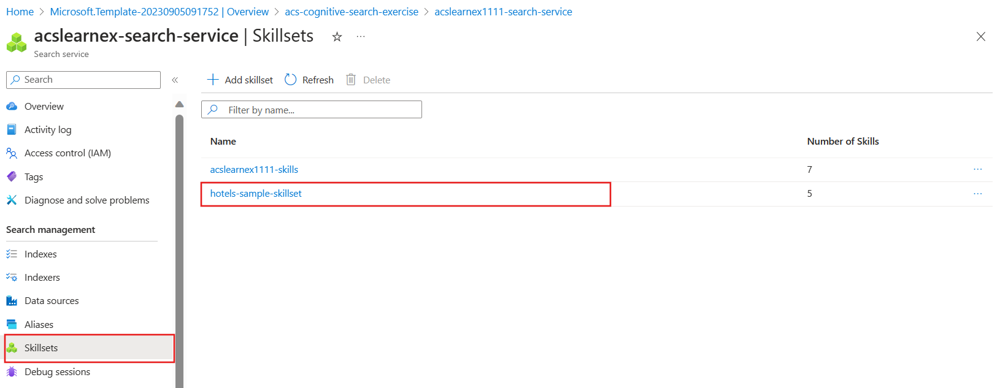

---
lab:
  title: Déboguer les problèmes liés à la recherche
---

# Déboguer les problèmes liés à la recherche

Vous avez créé votre solution de recherche, mais vous remarquez la présence d’avertissements sur l’indexeur.

Dans cet exercice, vous allez créer une solution Recherche Azure AI, importer des exemples de données, puis résoudre un avertissement sur l’indexeur.

> **Remarque** Pour effectuer cet exercice, vous aurez besoin d’un abonnement Microsoft Azure. Si vous n’en avez pas, vous pouvez vous inscrire à une évaluation gratuite dans la page [https://azure.com/free](https://azure.com/free?azure-portal=true).

## Créer une solution de recherche

Avant de pouvoir utiliser une session de débogage, vous devez créer un service Recherche cognitive Azure.

1.  Sélectionnez ce bouton pour déployer toutes les ressources dont vous avez besoin dans le portail Azure.

    

1. Sous **Groupe de ressources**, sélectionnez **Créer**.
1. Tapez **acs-cognitive-search-exercise**.
1. Sélectionnez la **Région** la plus proche de vous.
1. Pour **Préfixe de ressource**, entrez **acslearnex** et ajoutez une combinaison aléatoire de nombres ou de caractères pour garantir que le nom de stockage est unique.
1. Dans Emplacement, sélectionnez la même région que celle utilisée ci-dessus.
1. Au bas du volet, sélectionnez **Vérifier + créer**.
1. Attendez que la ressource soit déployée, puis sélectionnez **Accéder au groupe de ressources**.

## Importer des exemples de données

Une fois vos ressources créées, vous pouvez importer vos données sources.

1. Dans les ressources listées, sélectionnez le service de recherche.

1. Dans le volet **Vue d’ensemble**, sélectionnez **Importer des données**.

      

1. Dans le volet Importer des données, sélectionnez **Exemples** comme Source de données.

      

1. Dans la liste des exemples, sélectionnez **hotels-sample**.
1. Sélectionnez **Suivant : Ajouter des compétences cognitives (facultatif)**.
1. Développez la section **Ajouter des enrichissements**.

    

1. Sélectionnez **Compétences cognitives de texte**.
1. Sélectionnez **Suivant : Personnaliser l’index cible**.
1. Conservez les valeurs par défaut, puis sélectionnez **Suivant : Créer un indexeur**.
1. Sélectionnez **Envoyer**.

## Utiliser une session de débogage pour résoudre les avertissements sur votre indexeur

L’indexeur commence maintenant à ingérer 50 documents. Cependant, si vous examinez l’état de l’indexeur, vous constatez qu’il y a des avertissements.

1. Sélectionnez **Sessions de débogage** dans le volet gauche.

1. Sélectionnez **+ Ajouter une session de débogage**.

1. Sélectionnez **Choisir une connexion existante** pour Chaîne de connexion de stockage, puis sélectionnez votre compte de stockage.

    
1. Sélectionnez **+ Conteneur** pour ajouter un nouveau conteneur. Nommez-le **acs-debug-storage**.

    

1. Définissez son **Niveau d’accès anonyme** sur **Conteneur (accès en lecture anonyme pour les conteneurs et les objets blob)**.

1. Sélectionnez **Créer**.
1. Sélectionnez votre nouveau conteneur dans la liste, puis sélectionnez **Sélectionner**.

1. Sélectionnez **Enregistrer la session**.

    Le graphe des dépendances vous montre une erreur sur trois compétences pour chaque document.
    

1. Sélectionnez **V3**.
1. Dans le volet d’informations des compétences, sélectionnez **Erreurs/Avertissements(1)**.
1. Développez la colonne **Message** pour voir les détails.

    Les détails sont les suivants :

    *Code de langue non valide « (Inconnu) ». Langues prises en charge : ar, cs, da, de, en, es, fi, fr, hu, it, ja, ko, nl, no, pl, pt-BR, pt-PT, ru, sv, tr et zh-Hans. Pour plus de détails, consultez https://aka.ms/language-service/language-support.*

Si vous examinez le graphe des dépendances, la compétence Détection de langue a des sorties vers les trois compétences avec des avertissements. De plus, l’entrée de compétence à l’origine de l’erreur est `languageCode`.

1. Dans le graphe des dépendances, sélectionnez **Détection de langue**.

    
    Si vous examinez le code JSON des paramètres de compétence, vous pouvez voir que le champ utilisé pour déduire la langue est `HotelId`.

    Ce champ est à l’origine de l’erreur, car la compétence ne peut pas déterminer la langue en fonction d’un ID.

## Résoudre l’avertissement sur l’indexeur

1. Sélectionnez **Source** sous Entrées, puis remplacez la valeur du champ par `/document/Description`.
    
1. Sélectionnez **Enregistrer**.
1. Sélectionnez **Exécuter**.

    

    L’indexeur ne doit plus indiquer d’erreurs ou d’avertissements. L’ensemble de compétences peut maintenant être mis à jour.

1. Sélectionnez **Valider les modifications**.

    
1. Cliquez sur **OK**.

1. Vous devez maintenant faire en sorte que votre ensemble de compétences soit attaché à une ressource Azure AI Services, sans quoi vous allez atteindre le quota de base et l’indexeur va dépasser le délai d’expiration. Pour cela, sélectionnez **Ensembles de compétences** dans le volet gauche, puis sélectionnez votre **hotels-sample-skillset**.

    
1. Sélectionnez l’onglet **AI Services**, puis sélectionnez la ressource AI services dans la liste.

    
1. Sélectionnez **Enregistrer**.

1. Exécutez maintenant votre indexeur pour mettre à jour les documents avec les enrichissements d’IA corrigés. Pour cela, sélectionnez **Indexeurs** dans le volet gauche, sélectionnez **hotels-sample-indexer**, puis sélectionnez **Exécuter**.  Quand il a fini de s’exécuter, vous devez normalement voir que le nombre d’avertissements est maintenant de zéro.

    

> [!TIP]
> Maintenant que vous avez terminé l’exercice, si vous avez fini d’explorer les services Recherche Azure AI, supprimez les ressources Azure que vous avez créées au cours de l’exercice. Pour cela, le moyen le plus simple est de supprimer le groupe de ressources **acs-cognitive-search-exercise**.