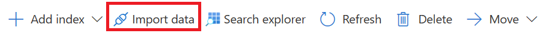

---
lab:
  title: Configurer un classeur sémantique
---

# Configurer un classeur sémantique

> **Remarque** Pour suivre ce labo, vous avez besoin d’un [abonnement Azure](https://azure.microsoft.com/free?azure-portal=true) dans lequel vous disposez d’un accès administratif. Cet exercice nécessite également le service **Recherche Azure AI** avec un niveau facturable.

Dans cet exercice, vous allez ajouter un classeur sémantique à un index, puis l’utiliser pour une requête.

## Activer un classeur sémantique

1. Ouvrez le portail Azure et connectez-vous.
1. Sélectionnez **Toutes les ressources** et votre service de recherche.
1. Dans le volet de navigation, sélectionnez **Classeur sémantique (préversion)**.
1. Dans **Disponibilité**, dans l’option **Gratuit**, sélectionnez **Sélectionner un plan**.


## Importer un exemple d’index

1. Retournez à la page **Vue d’ensemble** du service de recherche.
1. Sélectionnez **Importer des données**.

    

1. Dans **Source de données**, sélectionnez **Exemples**.
1. Sélectionnez **hotels-sample**, puis **Suivant : Ajoutez des compétences cognitives (facultatif)**.
1. Sélectionnez **Passer à : Personnaliser l’index cible**.
1. Sélectionnez **Suivant : Créer un indexeur**.
1. Sélectionnez **Envoyer**.

## Configurer le classement sémantique

Une fois que vous avez un index de recherche et un classeur sémantique activés, vous pouvez configurer le classement sémantique. Vous avez besoin d’un client de recherche qui prend en charge les API en préversion sur la demande de requête. Vous pouvez utiliser l’Explorateur de recherche dans le portail Azure, l’application Postman, le Kit SDK Azure pour .NET, ou le Kit SDK Azure pour Python. Dans cet exercice, vous allez utiliser l’Explorateur de recherche dans le portail Azure.

Pour configurer le classement sémantique, suivez les étapes suivantes :

1. Dans la barre de navigation, dans **Gestion de la recherche**, sélectionnez **Index**.

    

1. Sélectionnez votre index.
1. Sélectionnez **Configurations sémantiques**, puis **Ajouter une configuration sémantique**.
1. Dans **Nom**, tapez **hotels-conf**.
1. Dans **Champ de titre**, sélectionnez **HotelName**.
1. Sous **Champs de contenu**, dans **Nom du champ**, sélectionnez **Description**.
1. Répétez l’étape précédente pour les champs suivants :
    - **Catégorie**
    - **Adresse/Ville**
1. Sous **Champs de mot clé**, dans **Nom du champ**, sélectionnez **Balises**.
1. Sélectionnez **Enregistrer**.
1. Dans la page de votre index, sélectionnez **Enregistrer**.
1. Sélectionnez **Explorateur de recherche**.
1. Sélectionnez **Affichage**, puis **Vue JSON**.
1. Dans l'éditeur de requête JSON, tapez le texte suivant :

    ```json
        {
         "queryType": "semantic",
         "queryLanguage" : "en-us",
         "search": "all hotels near the water" , 
         "semanticConfiguration": "hotels-conf" , 
         "searchFields": "",
         "speller": "lexicon" , 
         "answers": "extractive|count-3",
         "count": true
        }
    ```

1. Sélectionnez **Rechercher**.
1. Examinez les résultats de la requête.

## Nettoyage

Si vous n’avez plus besoin du service Recherche Azure AI, vous devez supprimer la ressource de votre abonnement Azure afin de réduire les coûts.

>**Remarque** La suppression de votre service Recherche Azure AI garantit que votre abonnement ne sera pas facturé pour les ressources. Une petite quantité de stockage de données vous est cependant facturée tant que le stockage existe dans votre abonnement. Si vous avez terminé d’explorer le service Recherche cognitive, vous pouvez supprimer le service Recherche cognitive et les ressources associées. Toutefois, si vous envisagez de suivre d’autres labos de cette série, vous devrez le recréer.
> Pour supprimer vos ressources :
> 1. Dans le [portail Azure](https://portal.azure.com?azure-portal=true ), dans la page **Groupes de ressources**, ouvrez le groupe de ressources que vous avez spécifié lors de la création du service Recherche cognitive.
> 1. Cliquez sur **Supprimer le groupe de ressources**, tapez le nom du groupe de ressources pour confirmer que vous souhaitez le supprimer, puis sélectionnez **Supprimer**.
